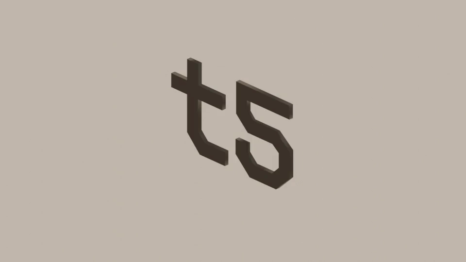

   
[<u>EN</u>] [<a href="ru.md">RU</a>]

   <h1>It`s me!</h1>
   
My name is t5 (derivative from tecxz5), or Tim (Timofey, idk)

   

   

   <h1 align="center">About me</h1>
   <ol>
      <li></li>
      <li></li>
      <li>16 y/o</li>
      <li>Native language: <b>russian</b>, don`t know English very well (this readme is half-translated by Google and Yandex translators)</li>
      <li>Helping with translations from English to Russian</li>
   </ol>

   <h1 align="center">What am I doing?</h1>
   <ol>
      <li>Writing websites (trying to learn JavaScript)</li>
      <li>Writing bots in Discord/Telegram</li>
      <li>Playing with Blender</li>
      <li>Flashing my phones (fuck Xiaomi)</li>
   </ol>

   <h1 align="center">What do I use?</h1>
   <ul>
      <li>Gigabyte G5 KC  
          
      </li>
   </ul>

   

