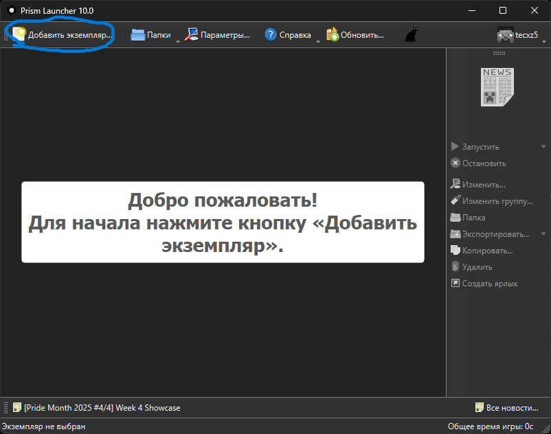
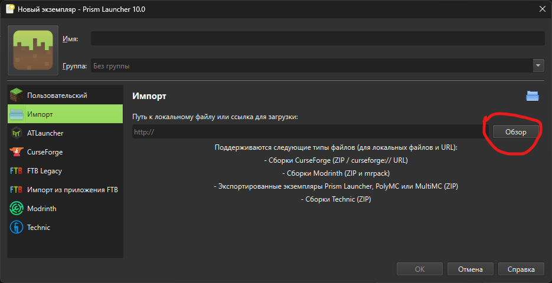
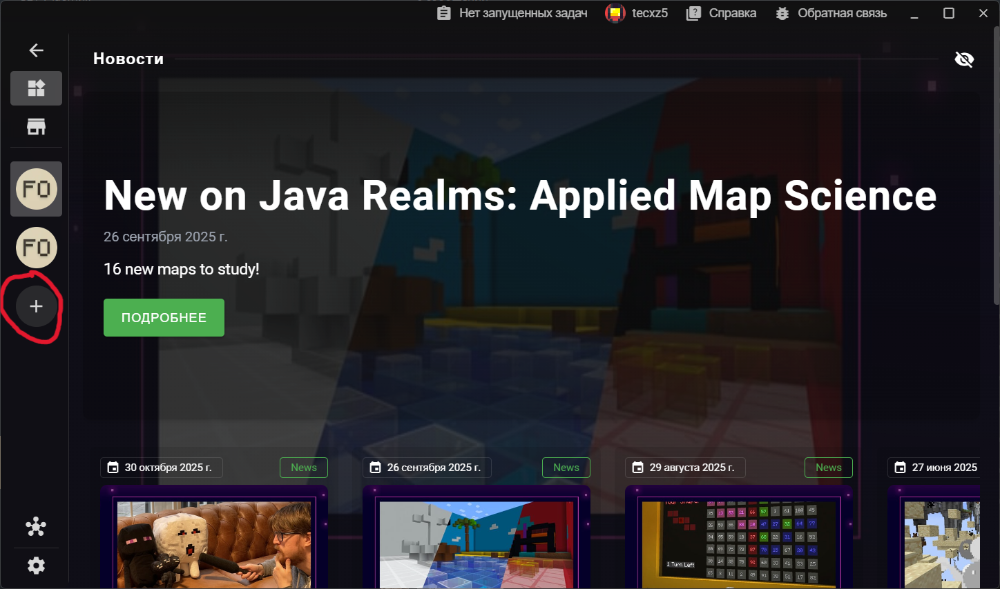
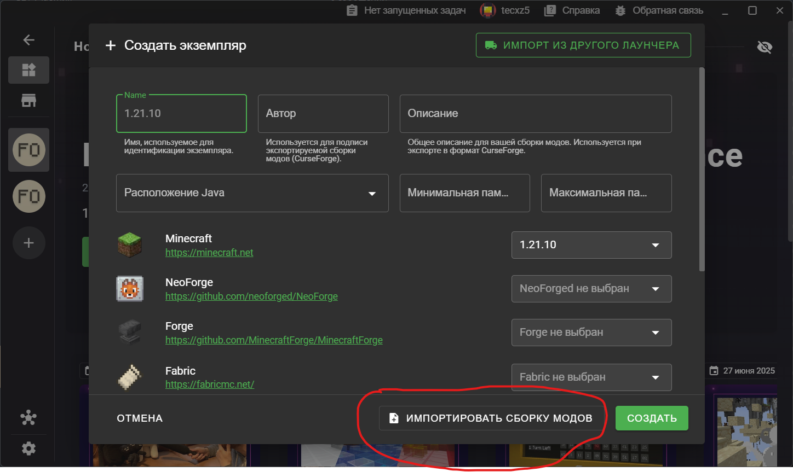
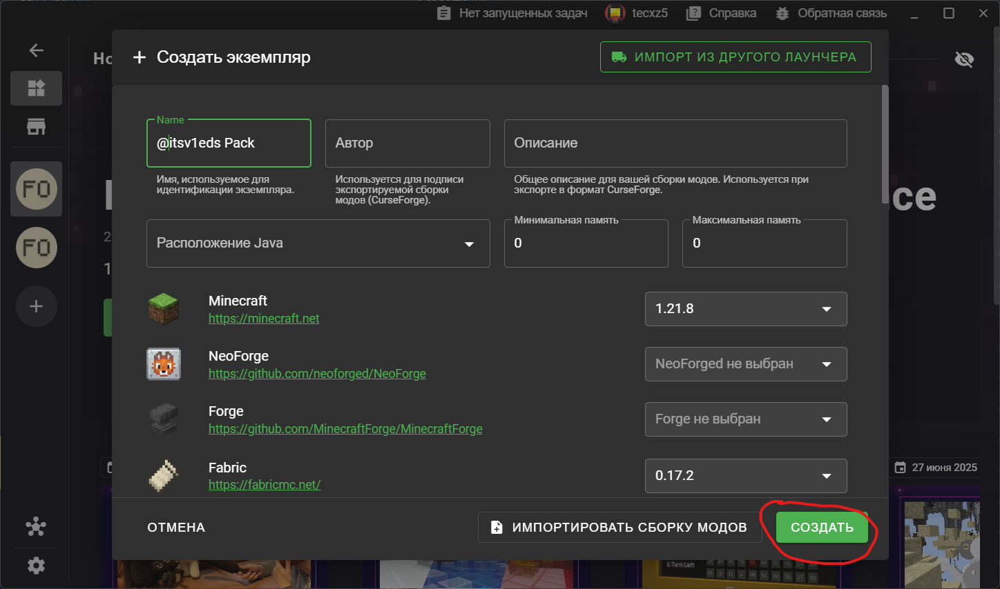

### доброе утро/день/вечер, вне зависимости от того когда вы решили это посмотреть, предлагаю вам тутор по сборкам, а точнее по их установку *(для начинающих, сидящих на тлаунчере/клаунчере и подобном **говне**)*

Для начала, **СНЕСИТЕ НАХУЙ ТЕ ЛАУНЧЕРЫ**, и поставьте нормальные:
- Prisma Launcher ([cкачать](https://github.com/Diegiwg/PrismLauncher-Cracked/releases)) (если не знали, оф. версия не дает делать автономные акки без акка с лицухой)
- X Minecraft Launcher, мой любимец (дальше XMCL) ([скачать](https://xmcl.app/)) 

#### Я буду пропускать этап установки, т.к. кем надо быть, чтобы не установить ебучий лаунчер?

# Prisma Launcher
*Допустим что вы прошли всю эту лабудень со скачкой с гитхаба, установкой и первоначальной настройкой*

1. Сразу нажимаем на "Добавить экземпляр" 
2. Выбираем "Импорт" и тыкаем "Обзор"

3. Ищите скачанную вами сборку и устанавливаете ее (лаунчер если надо сам всё сделает)
4. Готово! Теперь ждете пока скачается сам майнкрафт...

# XMCL
*если вы разобрались в его установке, то вы молодец*

1. Нажимаете на плюс 
2. Жмете "Импортировать сборку модов" 
3. Ищите зипку со сборкой
4. Нажимайте "Создать" (да, я для примера взял сборку виедса, мне надо взять несколько модов из нее) 
5. Ждете пока у вас всё установится и можете играть!

### вроде всё, лаунчер модринта если надо попозже сделаю (ну там в лс или в другие чаты отпишите, не надо никуда оффтопить)
